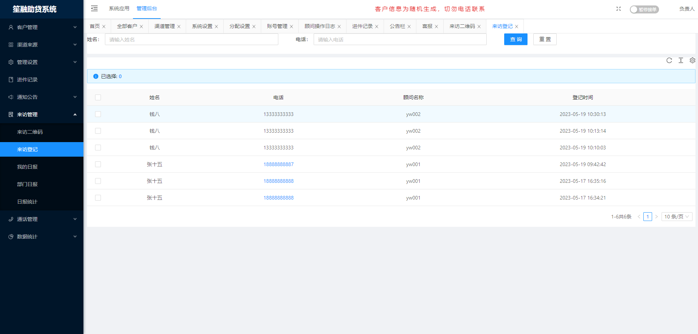
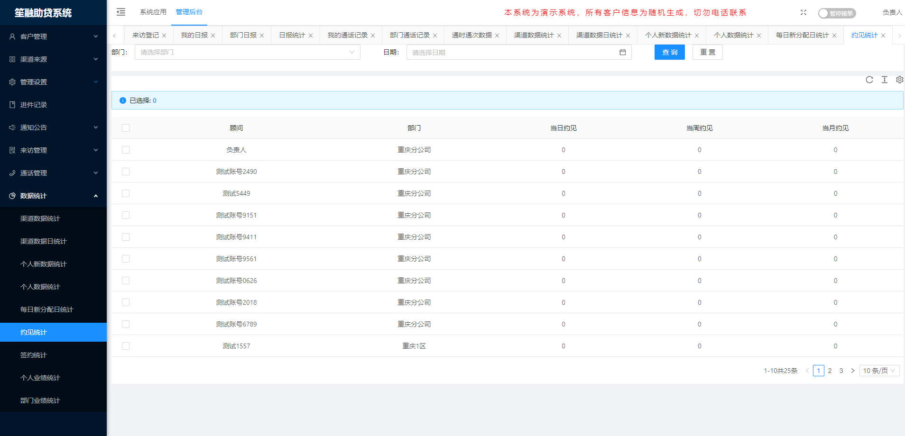

# 助贷CRM系统

#### 介绍
助贷CRM系统，不限坐席、支持总分公司架构使用、支持一键拨号、技术支持数据商、客户实时提醒、公海自动回收、黑名单限制、IP限制登录、支持上门拜访登记、支持业绩统计、一键清楚数据等等，欢迎体验。

使用JAVA语言开发，java1.8+mysql+redis+websocket

演示地址：
https://biz.hrcredit.cn/ 
后台管理系统地址及账号密码
账号：gsfzr 密码：123456

具体使用详情登录电脑端，看系统顶部“帮助工作”-操作手册。若有不习惯或者需要补充的地方，可以定制修改~
需要详细了解，请添加微信，加我的时候记得说助贷系统，谢谢~
#### 联系方式

#### 访客二维码

#### 系统截图

#### 拨号APP截图，暂只支持安卓手机

#### 联系方式

